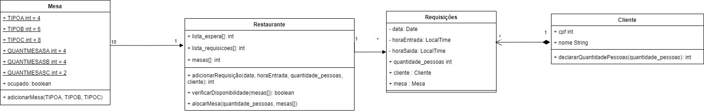
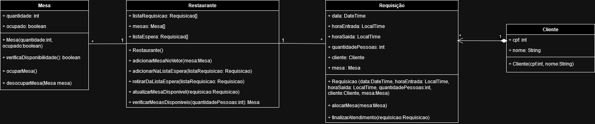
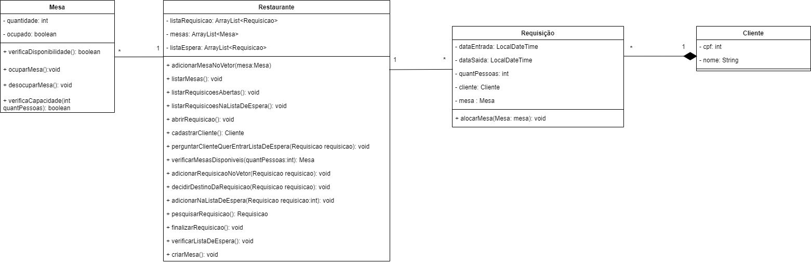
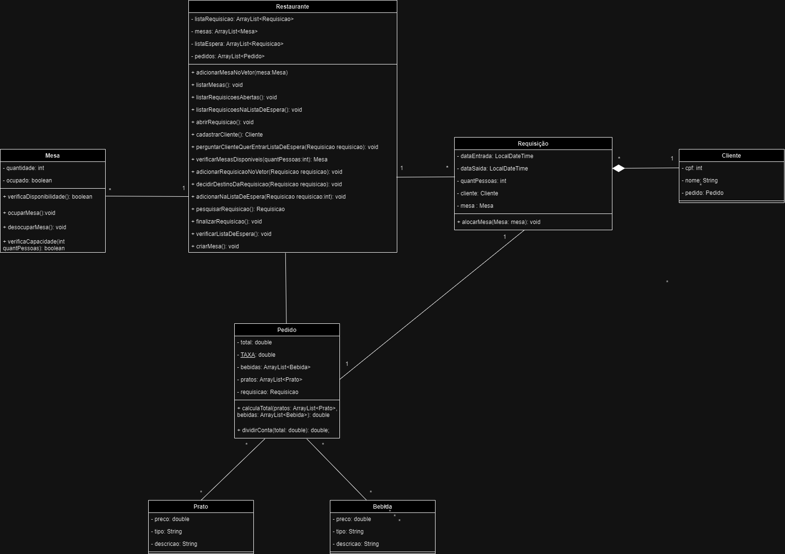
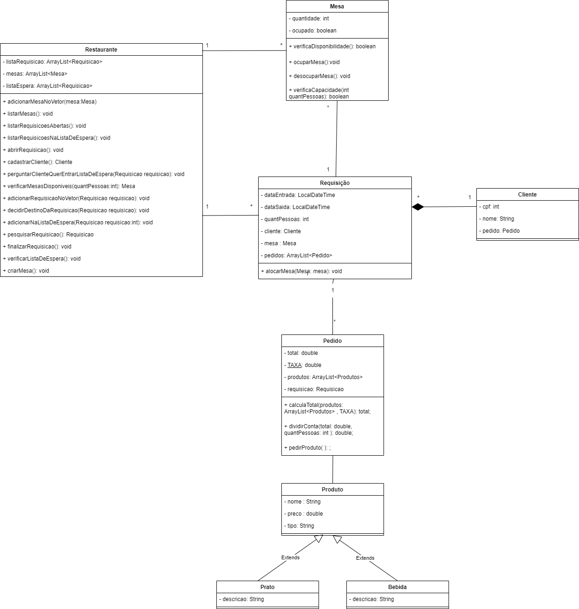
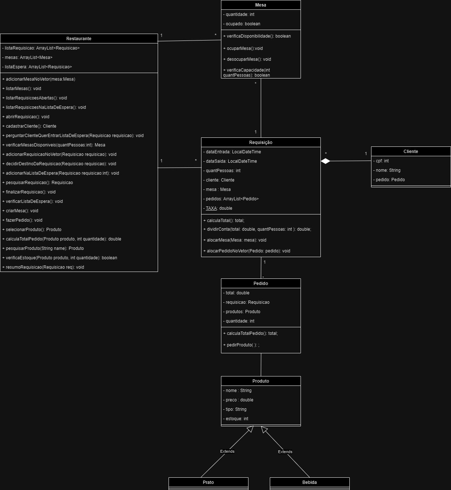

# Diagramas de classe
Coloque aqui todas as versões do seu diagrama de classes. Cada versão deve começar com um número de dois dígitos, na ordem crescente.

### V.1

### V.2

### V.3

### V.4

### V.5

### V.6

